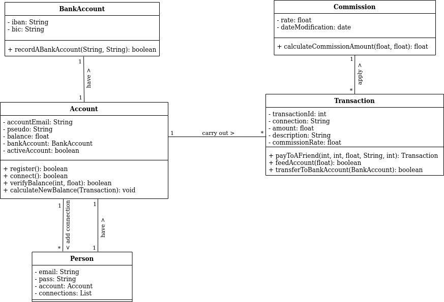
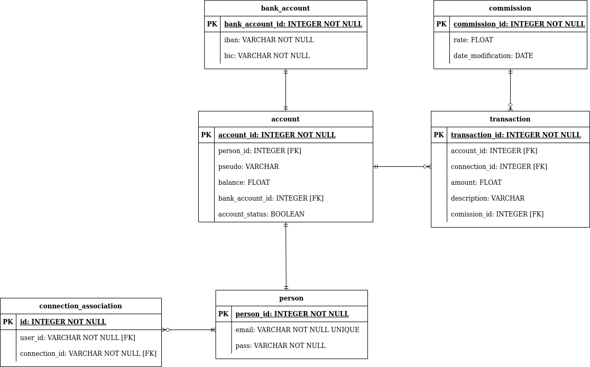

# Pay My Buddy
A web app to easily transfer money.

This app uses Java to run and MySQL to store data.

## Prerequisites  

What things we need for the project:

- Java 1.8
- Maven 4.0
- MySQL 8.0.27

## Technologies

- Eclipse IDE
- Spring Boot with starters:
    - Spring Web
    - Spring Data JPA
    - MySQL Driver

## UML Diagram

## Relational Model

## Preparation for the app running

You will have to set up the tables and data in the data base.
For this, please run the sql commands present in the files `data.sql` and `populate.sql` under the `resources` folder in the code base.
